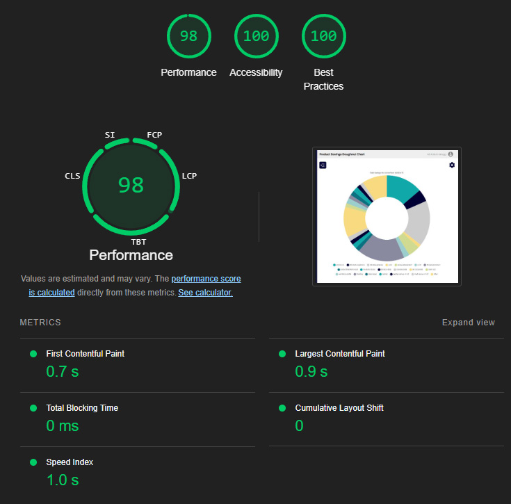

# ATAINR App

🚀 **A performant and optimized POC application**

> This app was initially built as a POC for a client using **React 17** and was recently upgraded to **Vite** + **React 18.3** + **TypeScript**.

The app processes a large and complex CSV file with over 2,000 lines of data. It formats the data and visualizes various savings through multiple chart variations. A standout feature is the custom-built doughnut chart, which includes advanced filtering capabilities such as:

- Downloading the chart as a JPEG or PNG image
- Selecting different time periods for analysis
- Filtering results to display the top 1-5% of performers

For the purpose of this demo, the original file upload functionality from the POC has been omitted.

## 🚀 Installation and Usage

## Development Server

1. Start the Development server:
   ```bash
     yarn dev
   ```

## Production Server

2. Start the Production server:

   ```bash
     yarn build

     yarn preview
   ```

## 🛠️ Technologies Used

-  **Vite** for fast builds and hot module replacement
-  **React** for building modular, scalable UI
-  **TypeScript** for type safety and better developer experience

## ⚡ Performance

### Lighthouse Performance Scores

The app scores highly across performance metrics. Some areas for improvement stem from third-party files (e.g., Vercel), but overall, the app delivers excellent performance.



## 🔍 Code Optimization

### Key Optimizations

- **Memoized Data**: The app uses `useMemo`, `useCallback`, and `React.memo` to avoid unnecessary re-renders, ensuring responsiveness and efficiency.
- **Minimal Prop Drilling**: With `useContext` and `useReducer`, the app achieves efficient state management by extracting and updating only the required data.
- **Reusable Components**: Components are modular, reusable, and designed for extensibility, reducing redundancy and enhancing maintainability.
- **Optimized Architecture**: The architecture emphasizes simplicity and scalability by leveraging React's component-based structure and hooks effectively.

---

### Future Enhancements

- Build out the chart settings menu to include further chart filters
- Dynamically change the chart without navigating (or as well as) to another page.
- Include more user settings for example updating name, email, avatar,
- More customisable options with the data, for example being able to modify which parameters are used to show the savings.
